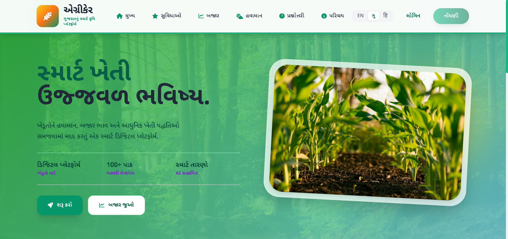
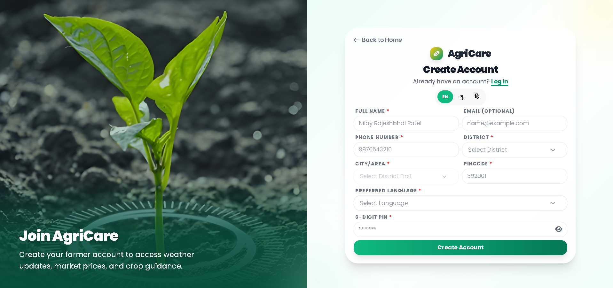
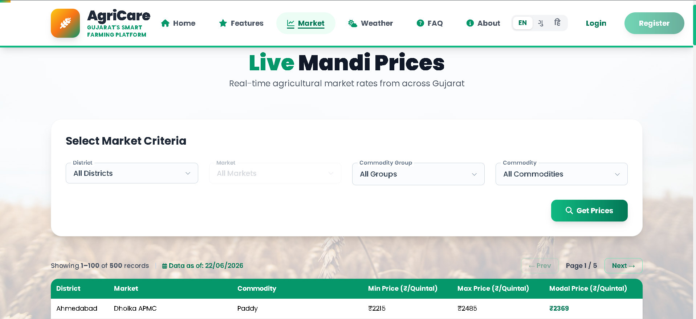
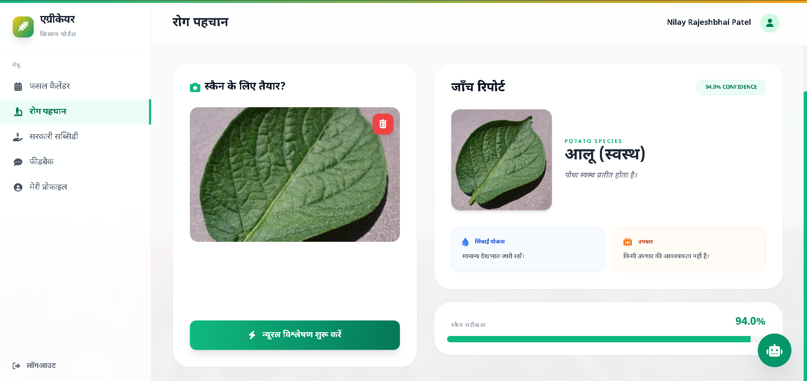
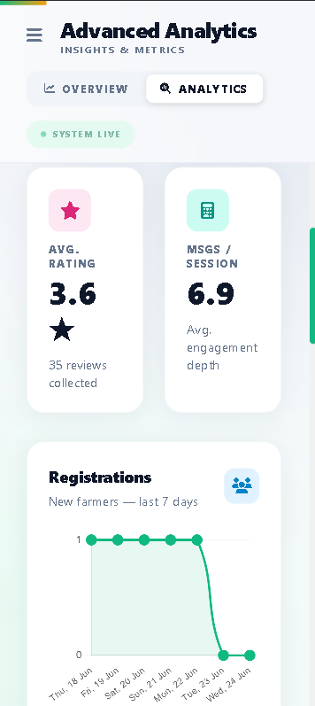

## Project Title & Tagline

# AgriCare  
Smart Agriculture Platform for Real-Time Market Insights

## Project Description

AgriCare is a web-based platform designed to assist farmers by providing real-time mandi prices, weather updates, and agricultural insights. It integrates government APIs and utilizes AI models to ensure accurate and up-to-date information, helping farmers make better decisions.

## Problem Statement

Farmers often lack access to real-time market prices, reliable agricultural data, and immediate crop health diagnostics, leading to poor decision-making and financial loss.

## Solution

AgriCare provides a centralized platform that delivers live mandi prices, weather updates, AI disease detection, and multilingual support, making it accessible and highly useful for farmers on both mobile and desktop.

## Features

- Live mandi price tracking  
- Search & filter (state, district, commodity)  
- Weather updates  
- Multi-language support  
- Admin & farmer management
- Crop disease detection  
- Chatbot & Crop Calendar
- Government Subsidies Tracking

## Tech Stack

- Frontend: HTML, CSS, JavaScript, Tailwind CSS, EJS  
- Backend: Node.js, Express.js  
- Database: MongoDB (via Mongoose)
- APIs: Agmarknet API, OpenMateo Weather API  

## System Architecture

User → Frontend (EJS/Tailwind) → Node.js Backend → APIs / MongoDB → Response → UI

## Database Design

- admins
- aiscans
- chatmessages
- crops
- farmers(users) 
- marketsprices
- pesticides
- sessions
- shops
- subsidies 

## Screenshots

## Installation

1. Clone repository  
2. Run `npm install` to install dependencies
3. Configure your `.env` file (MongoDB URI, JWT Secret, Weather API Key)
4. Run `npm run dev` to start the Node.js development server
5. Access the project on `http://localhost:3000`

## API Usage

Agmarknet API is used to fetch real-time crop prices in JSON format, which is cached locally by our Node server to improve load times.

## Challenges

- Migrating architecture from legacy PHP to modern Node.js
- Creating responsive, scroll-locked glassmorphism layouts for all devices
- Writing complex MongoDB aggregation pipelines for real-time market data

## Future Scope

- AI-based yield prediction  
- Dedicated Native Mobile app  
- OTP login system  

## Team

- Nilay Patel – Frontend + Backend 
- Garv – Frontend + ML
- Mihir – Backend + ML

## License

Academic project (SGP CEUP201)
